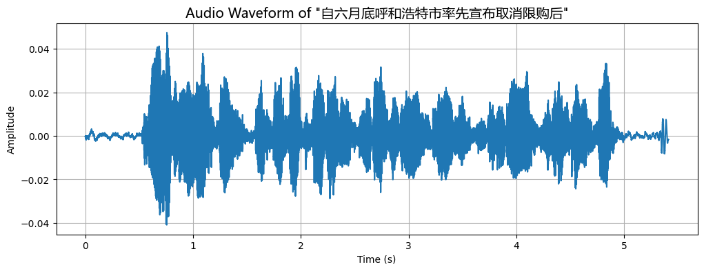

# README



基于Efficient Conformer的Aishell1中文语音识别项目，包括数据处理、模型搭建、训练、推理等。

## 环境

- Lenovo XiaoXin Pro 14
- 硬件只有cpu

```bash
pip install -r requirement.txt
```

## 数据

数据集：[Aishell-1](https://www.openslr.org/33/)
数据集下载后放在`data`目录下，目录结构如下：

```text
data
└── aishell
    ├── transcript
    └── wav
```

这里只包含ashell三个数据`data\aishell\wav\S0002.tar.gz`, `data\aishell\wav\S0003.tar.gz`, `data\aishell\wav\S0004.tar.gz`。执行解压命令：

```bash
cd data/aishell/wav
tar -zxvf S0002.tar.gz
tar -zxvf S0003.tar.gz
tar -zxvf S0004.tar.gz
```

这里将S0004作为验证集，S0002和S0003作为训练集。

```bash
mkdir dev
mv train/S0004 dev
```

添加`.gitignore`文件，忽略`data/aishell/wav/train`和`data/aishell/wav/dev`目录。

```text
data/aishell/wav/train
data/aishell/wav/dev
```

## reference🔗

- [[2109.01163\] Efficient conformer: Progressive downsampling and grouped attention for automatic speech recognition (arxiv.org)](https://arxiv.org/abs/2109.01163)
- [burchim/EfficientConformer: ASRU 2021  Efficient Conformer: Progressive Downsampling and Grouped Attention for Automatic Speech Recognition (github.com)](https://github.com/burchim/EfficientConformer)
